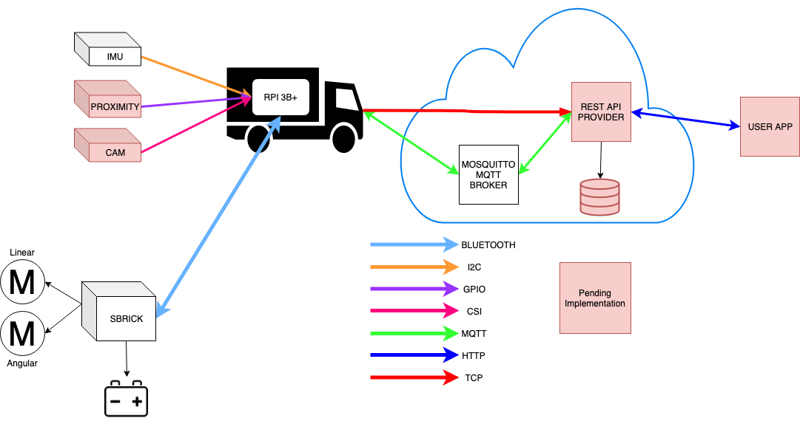
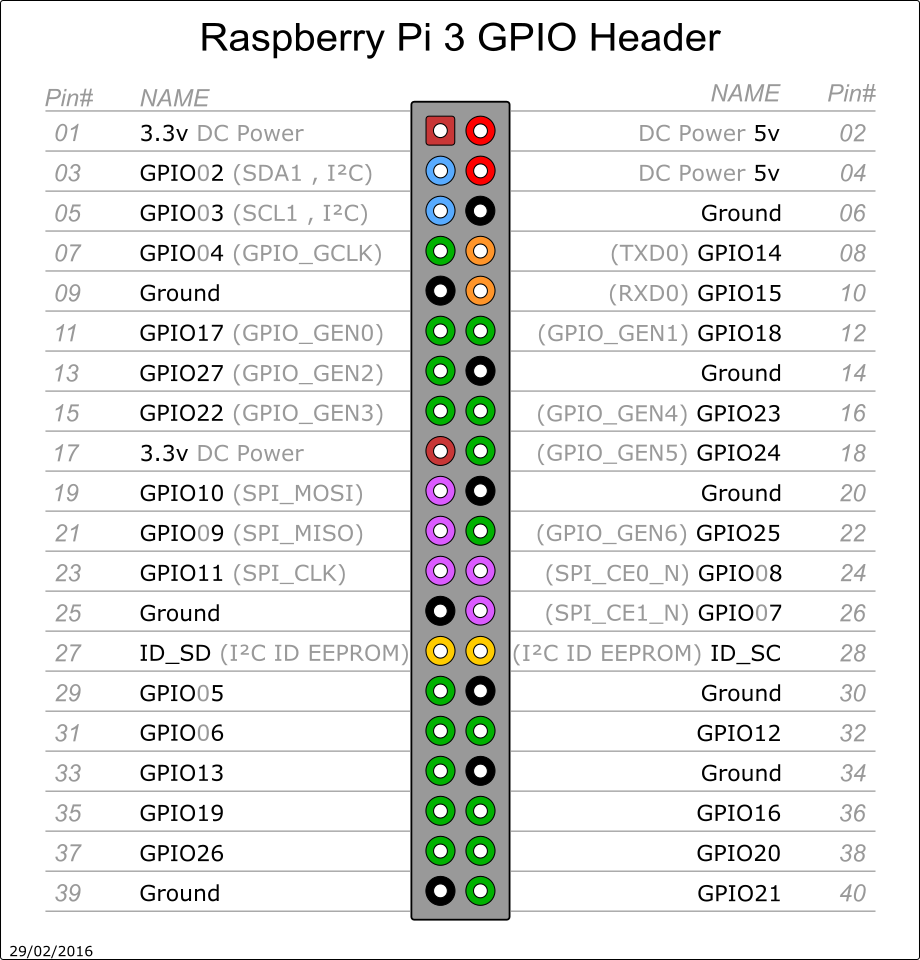
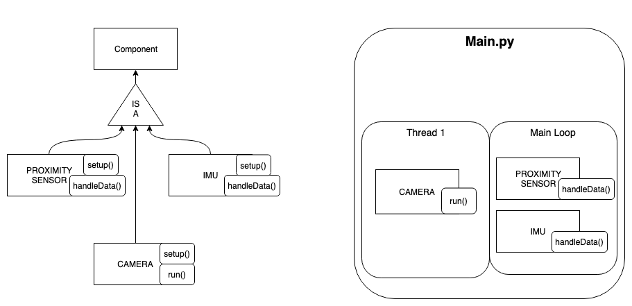

# Introduction
This repo contains a framework to extract data acquired from sensors connected to a Rpi, using the MQTT protocol, as well as provide an easy way to access those data points using a REST API.

For this example we are using a remote control LEGO Truck (Mercedes-Benz Arocs) in conjuction with a RPI connected to an Innertial Measurement Unit(IMU), a Camera module and a Sonar Sensor Module.



# Requirements and connection for data streamming

## Required hardware

- MPU-9250 (IMU);
- Camera Module;
- Sonar Module;
- Micro SD card + Adaptor to connect to your laptop;
- Raspberry Pi 3 Model B+ (RPi) + Charger;
- Keyboard + mouse + screen;
- Jumper wires to connect sensor to RPi (some other options are available);

The sources that were used to set up the RPi were mainly: 
- https://kingtidesailing.blogspot.com/2016/02/how-to-setup-mpu-9250-on-raspberry-pi_25.html
- https://github.com/richardstechnotes/RTIMULib2
- https://github.com/BensonHsu/SBrick-Framework

So it is expected that most of the instructions will be similar to the ones you can find there. 

---
### Setting up the RPI
#### Step 1: OS setup on RPi

In order to setup your RPi follow the instructions [here](https://projects.raspberrypi.org/en/projects/raspberry-pi-setting-up/3). 
In the end you should have your RPi up and running with its own OS. 


#### Step 2: Connect the cables

The sensor will have the GND, VCC, SDA and SCL pins connected to the RPi. Here you need to be careful to connect the VCC to the right pin in the RPi otherwise you can damage it. So, following the diagram:


 


You should connect:

| Raspberry Pi (RPi) | Sensor MPU-9250 |
| ------ | ------ |
| 3.3 VDC Power - 1 | VCC |
| GPIO 8 SDA1 (I2C) - 3 | SDA |
| GPIO 9 SCL1 (I2C) - 5 | SCL |
| Ground - 9 | GND |

---

### Setting up MQTT Broker

MQTT is a lightweight, low power, easy to implement publish/subscribe protocol which makes it ideal for the M2M(Machine to Machine) communication performed by IOT devices.
If you are new to MQTT I recommend reading [this article](https://1sheeld.com/mqtt-protocol/).
#### Step 1: Set up your MQTT Broker
You can use a free online mqtt broker such as the [Mosquitto Test Broker](https://test.mosquitto.org/), although it is not recommended, since you won't have any control over the broker, and anyone can listen and publish to your topics.

For this example we are using a **MOSQUITTO** broker set-up in the cloud, and you can set-up your own following this [tutorial](https://obrienlabs.net/how-to-setup-your-own-mqtt-broker/) 

#### Step 2: Testing the MQTT Broker:
In order to check if the MQTT broker was setup correctly you can use the **mosquitto_pub** tool to publish to a test topic.

First install **mosquitto**
```bash
$ apt-get install mosquitto mosquitto-clients
```
Then open another terminal window and subscribe to the topic
```bash
$ mosquitto_sub -h YourBrokerIp -t test -v
```
And in the first terminal window publish something to the test topic
```bash
$ mosquitto_pub -h YourBrokerIp -t test -m "Hello World"
```
If everything is working correctly you should see the message on the terminal running the susbcriber.

#### Step 3: Configure the MQTT Client
In this repository you can find the [configuration file](config/configuration.py). There you can add all the information relative to your MQTT broker and the mqttClient should work without further modifications.


---
### Setting up new components

New components can be easily set up by implementing the [componentClass](componentClass.py) which provides the constructor and the mqttHandler for communication with the broker using the methods provided by the [Paho-MQTT Library](https://pypi.org/project/paho-mqtt/) by the Eclipse foundation.   

Although only the **run** method is necessary for the main to function, the idea is to use the **setup** method for specific device setup operations, the **dataHandling** method to acquire and publish data from the component, and the **run** method to control the running loop.

For an example of this implementation check the [imuClass](imuClass.py)



#### MQTT topics framework
In order to maintain consistency, all new topics should follow the framework:
```
project/component

Eg. truck1/imu : JSON payload containing the data given by the IMU in truck1.
{
    'accel': {
        'x': "X-axis value of the accelerometer",
        'y': "Y-axis value of the accelerometer",
        'z': "Z-axis value of the accelerometer"
    },
    'gyro': {
        'x': "X-axis value of the gyroscope",
        'y': "Y-axis value of the gyroscope",
        'z': "Z-axis value of the gyroscope"
    },
    'timestamp': "Timestamp of the measurement"
}   
```

#### Adding the components to the system

After the compnent has been set up and tested on its own, you can run it in parallel to the other components by simply altering the **componentDic** on the [configuration](config/configuration.py) file, as so:

```
componentDic = {"imuClass" : "Imu", "Name Of The File", "Name Of The Class"}
```
And the [main.py](main.py) will import it, create the object and invoke the **run** method of all the components in parallel

**Note:** The effect this has on reading several sensors has yet to be tested, although it shouldn't be a problem due to the quad core nature of the Rpi3B+.


---
### Setting up the IMU data streamming

#### Step 1: Install libraries and connect the sensor

Create and cd into the folder where the whole project will sit (and create a scripts folder that will be used later as our working directory):
```sh
$ mkdir truck_project_db
$ cd truck_project_db
$ mkdir scripts 
```

Then install the I2C software
```sh
$ sudo apt-get install i2c-tools
```

In the Menu (top left corner) go to Preferences > Raspberry Pi Configuration > Interfaces and enable i2c. This last step requires a reboot.
```sh
$ sudo reboot
```

Verify if the sensor is connected by running
```sh
$ sudo i2cdetect -y 1
```
the number 68 should show up in the grid, corresponding to the sensor's default address.

The following installations are needed:
```sh
$ sudo apt-get install cmake
$ sudo apt-get install python-dev
$ sudo apt-get install octave
```

If you get an error related with jre-headless run the following:
```sh
$ sudo apt-get purge openjdk-8-jre-headless
$ sudo apt-get install openjdk-8-jre-headless
$ sudo apt-get install openjdk-8-jre
```

Next clone the repository that has the tools to interface with the sensor:
```sh
$ git clone https://github.com/richardstechnotes/RTIMULib2.git
```

This repository contains several different apps that might be worth exploring. In our case we are going to install only the app that will help us to calibrate the sensor:
```sh
$ cd RTIMULib2/Linux/RTIMULibCal
$ make -j4
$ sudo make install
```

Then we need to copy `RTEllipsoidFit` folder into a folder that is at the same level as our working directory (requirement stated in the `RTIMULib` repo) - in our case `scripts` folder: 
```sh
$ cp -r /home/pi/truck_project_db/RTIMULib2/RTEllipsoidFit/ /home/pi/truck_project_db/
$ cd /home/pi/truck_project_db/RTEllipsoidFit/
```
Follows some edits stated in the `RTIMULib`'s repo before we can proceed to calibrate our sensor. 

- edit file `/etc/modules`
    ```sh
    $ sudo vi /etc/modules
    ```
    this file should contain the following lines uncommented / added:
    
    	i2c-dev
    	i2c-bcm2708

- edit/create file `/etc/udev/rules.d/90-i2c.rules`:
    ```sh
    $ sudo vi /etc/udev/rules.d/90-i2c.rules
    ```
    add the following line to the file:
    
        KERNEL==“i2c-[0-7]”,MODE=“0666” in /etc/udev/rules.d/90-i2c.rules


- edit/create file `/boot/config.txt`:
    ```sh
    $ sudo vi /boot/config.txt
    ```
    
    and add at the bottom of the file the line
    
        dtparam=i2c1_baudrate=400000

After all the edits reboot your RPi:
```sh
$ sudo reboot
```

#### Step 2: Calibrating MPU-9250 

From `/home/pi/truck_project_db/RTEllipsoidFit/` run
```sh
$ RTIMULibCal 
```
    
and follow the instructions to calibrate the sensor. Then copy the file resulting from the calibration `RTIMULib.ini` to the working directory:
```sh
$ cp RTIMULib.ini /home/pi/truck_project_db/scripts
```

in order to change the sampling rate it is advised to do so in the file `RTIMULib.ini`. In this particular example we tuned the following parameters:
```
MPU9250GyroAccelSampleRate=5
MPU9250CompassSampleRate=5
MPU9250GyroLpf=2
MPU9250AccelLpf=2
```

	
#### Step 3: Visualizing the sensor (optional)
In order to evaluate if the calibration process went well we will use a visualization tool `RTIMULibDemoGL` that will read the sensor data and show the axis orientation in real-time. In order to setup the RTIMULibDemoGL app you need to install the following:
```sh
$ sudo apt-get install cmake
$ sudo apt-get install libqt4-dev
```

Then we can proceed with the instalation of the app:
```sh
$ cd /home/pi/RTIMULib2/Linux/RTIMULibDemoGL
$ qmake
$ make -j4
$ sudo make install
```

Now if you want to try out and visualize your sensor working run
```sh
$ RTIMULibDemoGL
```

Other apps are available in `/RTIMULib2/Linux/`. Check out its repo for description of the apps and how to set them up.


#### Step 4: Streamming the IMU data
To begin streamming the IMU data to the MQTT broker, run the [imuClass.py](imuClass.py).
In this case the data will be published to the topic **/truck1/imu** with the following format:
```
{
    'accel': {
        'x': "X-axis value of the accelerometer",
        'y': "Y-axis value of the accelerometer",
        'z': "Z-axis value of the accelerometer"
    },
    'gyro': {
        'x': "X-axis value of the gyroscope",
        'y': "Y-axis value of the gyroscope",
        'z': "Z-axis value of the gyroscope"
    },
    'timestamp': "Timestamp of the measurement"
}   
```

Nevertheless you can change the topics to whatever fits your project best.

----

### Setting up the communication with the S-BRICK

The LEGO Truck uses a S-BRICK with a bluetooth interface to allow the user to control the motors using the S-BRICK app. Since our objective is to have all the components communicating using MQTT we can use the open source framework created by [Benson Hsu](https://github.com/BensonHsu/SBrick-Framework) to implement the bluetooth communication as well as listening for commands sent via MQTT.

#### Step 1: Install and setup the SBrick Framework
Follow the instructions contained in the [SBrick Framework repo](https://github.com/BensonHsu/SBrick-Framework) and save your SBrick MAC address, it will be used in the next step.

##### Note: I highly recommend using the branch patch-01 from this [fork](https://github.com/tiagomiotto/SBrick-Framework/) of the repository since it adds support for authentication. It also corrects some errors that were causing the disconnection of the SBrick and further crashing of the program. A pull request has already been made to the master repository, but as of time of writing hasn't been accepted.

#### Step 2: Run the SBrick server
Start the sbrick daemon with:
```bash
$ sudo python3 sbrick_server.py --connect --broker-ip YourBrokerIP --broker-port YourBrokerPort --log-level debug --sbrick-id YourSBrickMAC
```

#### Step 3: Communicate with the SBrick
The framework offers an array of messages and communications, which can be explored to the fullest in the future, but since we are only interested in controlling the motors only two are relevant:

```
# Publish this to sbrick/01/sp/drive
drive_msgs ={
    "sbrick_id": "YourSbrickMac",  #"string. SBrick ID. <sbrick MAC>",
    "channel": "02",  #" string. hex string. the LEGO power function port you want to drive. <00|01|02|03>. In our case channel 00 is for turning, and channel 02 is for driving straight",
    "direction": "01", #"string. clockwise or counterclockwise. <00|01>",
    "power": "ff", #"string. hex string. FF means 100% speed. <00~FF>",
    "exec_time": 5556 # "number. seconds. 5566 means forever."
    }

# Publish this to sbrick/01/sp/stop
stop_msg ={
    "sbrick_id": "YourSbrickMac",  #"string. SBrick ID. <sbrick MAC>",
    "channels": ['00', '01','02','03']  #" string. hex string. the LEGO power function port you want to drive. <00|01|02|03>",
}

get_adc = {
    'status': 0, 
    'req_msg': '{
        "sbrick_id": "Your SBrick"
    }',
    'resp_topic': 'sbrick/01/rr_resp/get_adc'
}
```

#### Step 4: Testing the controls
In order to test the drive you can use the controller provided in [rcController.py](controller/rcController.py) and follow the instructions provided there.

#### Step 5: Getting the Temperature and Battery Voltage of the Sbrick (Optional)
You can also get information on battery voltage and the temperature of the SBrick by publishing to the topic **/sbrick/01/rr/get_adc** the following message

```
get_adc = {
    'status': 0, 
    'req_msg': '{
        "sbrick_id": "Your SBrick"
    }',
    'resp_topic': 'Topic to get the response' #usually '/sbrick/01/rr_resp/get_adc'
}
```
---

### Setting up the Camera
Still not implemented

---

### Setting up the Proximity Sensors
Still not implemented

---
## Running the program
After all the setting up is done just run [main.py](main.py) like
```
python main.py
```

---
### Worth checking:

[Setting up a script to run on Rpi Boot](http://pi.bek.no/autostartProgramOnBoot/)

---
### Contributing

Review [the contributing guidelines](CONTRIBUTING.md) before you make your awesome contribution


---
### License

This project is licensed under the terms of the MIT license. See [LICENSE](LICENSE) 